# Tutorial: Técnicas de Preprocesamiento en Machine Learning

## Índice

1. [Introducción](#introducción)
2. [Imputación de Valores Faltantes](#imputación-de-valores-faltantes)
3. [Codificación de Variables Categóricas](#codificación-de-variables-categóricas)
4. [Escalado y Normalización](#escalado-y-normalización)
5. [Reducción de Dimensionalidad: PCA](#reducción-de-dimensionalidad-pca)
6. [Feature Engineering](#feature-engineering)
7. [Preprocesamiento de Texto](#preprocesamiento-de-texto)
8. [Preprocesamiento de Imágenes](#preprocesamiento-de-imágenes)
9. [Pipeline Completo](#pipeline-completo)
10. [Referencias](#referencias)

---

## Introducción

El **preprocesamiento de datos** es un paso fundamental en cualquier proyecto de machine learning. Los datos del mundo real rara vez vienen en el formato ideal para entrenar modelos: pueden tener valores faltantes, diferentes escalas, categorías en forma de texto, y más.

### ¿Por qué es importante?

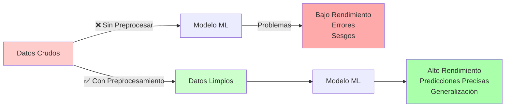

### Flujo Típico de Preprocesamiento

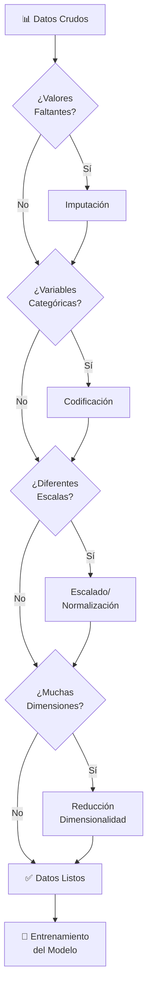

---

## Imputación de Valores Faltantes

### ¿Qué son los valores faltantes?

Los valores faltantes (NaN, None, null) son datos ausentes en nuestro dataset. Pueden aparecer por:
- Errores de recolección
- Datos no aplicables
- Respuestas omitidas en encuestas
- Fallas en sensores

### Estrategias de Imputación

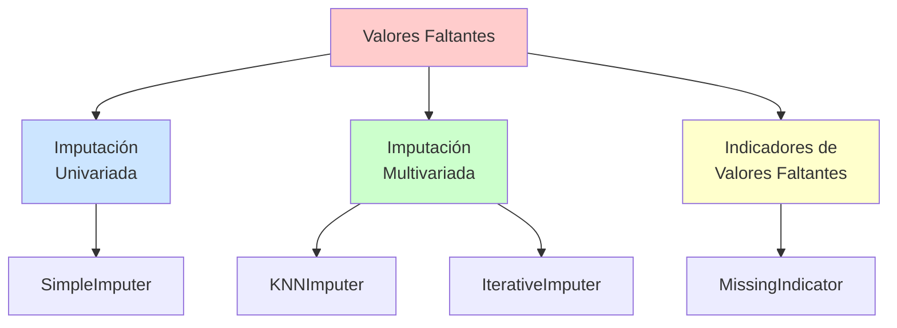

---

### 1. SimpleImputer (Imputación Univariada)

**Concepto**: Reemplaza valores faltantes usando estadísticas de **una sola columna** (media, mediana, moda, o valor constante).

#### Estrategias Disponibles

| Estrategia | Tipo de Datos | Descripción | Cuándo Usarla |
|------------|---------------|-------------|---------------|
| **`mean`** | Numéricos | Promedio de la columna | Datos con distribución normal, sin outliers |
| **`median`** | Numéricos | Valor central de la columna | Datos con outliers o distribución sesgada |
| **`most_frequent`** | Numéricos o Categóricos | Valor más común (moda) | Variables categóricas o discretas |
| **`constant`** | Cualquiera | Valor fijo especificado | Cuando 0 o un valor específico tiene sentido |

#### Ejemplo Visual

```
Dataset Original:
┌─────┬─────┬──────────┐
│ Age │ Sex │ Embarked │
├─────┼─────┼──────────┤
│ 22  │ M   │ S        │
│ NaN │ F   │ C        │
│ 35  │ F   │ NaN      │
│ 45  │ M   │ S        │
└─────┴─────┴──────────┘

Después de SimpleImputer:
- Age: NaN → 34 (median)
- Embarked: NaN → 'S' (most_frequent)

┌─────┬─────┬──────────┐
│ Age │ Sex │ Embarked │
├─────┼─────┼──────────┤
│ 22  │ M   │ S        │
│ 34  │ F   │ C        │
│ 35  │ F   │ S        │
│ 45  │ M   │ S        │
└─────┴─────┴──────────┘
```

#### Código con scikit-learn

```python
from sklearn.impute import SimpleImputer
import numpy as np
import pandas as pd

# Datos con valores faltantes
X = np.array([[1, 2], [np.nan, 3], [7, 6]])

# Imputación con la MEDIA
imputer_mean = SimpleImputer(missing_values=np.nan, strategy='mean')
X_imputed = imputer_mean.fit_transform(X)
# Resultado: [[1, 2], [4, 3], [7, 6]]  ← El NaN se reemplaza por 4 (media de 1 y 7)

# Imputación con la MEDIANA
imputer_median = SimpleImputer(strategy='median')
X_imputed = imputer_median.fit_transform(X)

# Imputación con VALOR CONSTANTE
imputer_const = SimpleImputer(strategy='constant', fill_value=0)
X_imputed = imputer_const.fit_transform(X)

# Para datos categóricos
df = pd.DataFrame([["a", "x"],
                   [np.nan, "y"],
                   ["a", np.nan],
                   ["b", "y"]], dtype="category")

imputer_cat = SimpleImputer(strategy="most_frequent")
df_imputed = imputer_cat.fit_transform(df)
# NaN se reemplaza con 'a' (más frecuente en col 1) y 'y' (más frecuente en col 2)
```

#### Ventajas y Desventajas

| ✅ Ventajas | ❌ Desventajas |
|------------|----------------|
| Rápido y simple | No considera relaciones entre variables |
| Funciona bien con pocos valores faltantes | Puede reducir la varianza |
| No requiere muchos datos | Puede introducir sesgo |
| Compatible con sparse matrices | No captura patrones complejos |

---

### 2. KNNImputer (K-Nearest Neighbors)

**Concepto**: Imputa valores faltantes usando el **promedio de los k vecinos más cercanos**. Considera **múltiples columnas** para encontrar similitudes.

#### ¿Cómo Funciona?

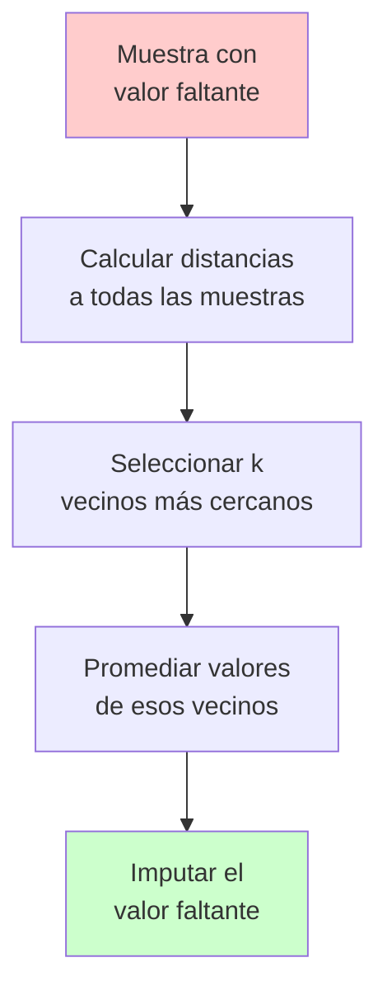

#### Ejemplo Visual

```
Dataset:
┌─────┬──────┬──────┐
│ Age │ Fare │ Sex  │
├─────┼──────┼──────┤
│ 22  │ 7.25 │ M    │  ← Vecino 1
│ 25  │ 8.05 │ F    │  ← Vecino 2
│ NaN │ 7.50 │ M    │  ← Muestra a imputar
│ 50  │ 30.0 │ M    │
└─────┴──────┴──────┘

KNNImputer (k=2):
1. Encuentra las 2 muestras más similares (por Fare y Sex)
2. Vecinos: Muestra 1 (Age=22) y Muestra 2 (Age=25)
3. Imputa: Age = (22 + 25) / 2 = 23.5
```

#### Código con scikit-learn

```python
from sklearn.impute import KNNImputer
import numpy as np

X = np.array([[1, 2, np.nan],
              [3, 4, 3],
              [np.nan, 6, 5],
              [8, 8, 7]])

# Imputación con k=2 vecinos más cercanos
imputer = KNNImputer(n_neighbors=2, weights="uniform")
X_imputed = imputer.fit_transform(X)

# También puedes usar weights="distance" para dar más peso a vecinos cercanos
imputer_weighted = KNNImputer(n_neighbors=2, weights="distance")
X_imputed_weighted = imputer_weighted.fit_transform(X)
```

#### Parámetros Importantes

| Parámetro | Descripción | Valores Comunes |
|-----------|-------------|-----------------|
| `n_neighbors` | Número de vecinos a considerar | 3, 5, 7 (impar preferible) |
| `weights` | Peso de los vecinos | `"uniform"` o `"distance"` |
| `metric` | Métrica de distancia | `"euclidean"`, `"manhattan"` |

#### Ventajas y Desventajas

| ✅ Ventajas | ❌ Desventajas |
|------------|----------------|
| Considera relaciones entre variables | Más lento que SimpleImputer |
| Más preciso que métodos univariados | Sensible a la escala de los datos |
| Funciona bien con datos continuos | Requiere que k < número de muestras |
| No reduce tanto la varianza | No funciona bien con alta dimensionalidad |

---

### 3. IterativeImputer (Imputación Iterativa Multivariada)

**Concepto**: Modela cada variable con valores faltantes como una **función de las demás variables**. Usa un modelo de regresión para predecir los valores faltantes de forma iterativa.

**Inspiración**: Algoritmo MICE (Multivariate Imputation by Chained Equations).

#### ¿Cómo Funciona?

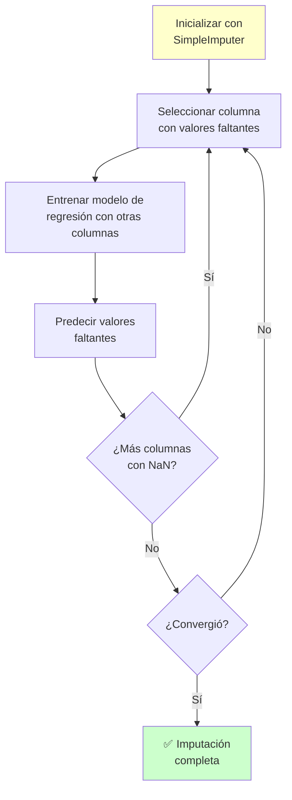

#### Ejemplo Conceptual

```
Iteración 1:
- Columna 'Age' tiene NaN
- Usa 'Fare' y 'Pclass' para predecir Age
- Age_predicted = f(Fare, Pclass)

Iteración 2:
- Columna 'Fare' tiene NaN
- Usa 'Age' (ya imputada) y 'Pclass' para predecir Fare
- Fare_predicted = g(Age, Pclass)

Iteración 3:
- Refina 'Age' con el nuevo 'Fare' imputado
- Age_refined = f(Fare_new, Pclass)

... Repite hasta convergencia
```

#### Código con scikit-learn

```python
from sklearn.experimental import enable_iterative_imputer  # ¡Necesario!
from sklearn.impute import IterativeImputer
import numpy as np

X = np.array([[1, 2],
              [3, 6],
              [4, 8],
              [np.nan, 3],
              [7, np.nan]])

# Imputación iterativa con 10 iteraciones máximas
imputer = IterativeImputer(max_iter=10, random_state=0)
X_imputed = imputer.fit_transform(X)

# Puedes especificar el estimador (modelo de regresión)
from sklearn.ensemble import RandomForestRegressor

imputer_rf = IterativeImputer(
    estimator=RandomForestRegressor(n_estimators=10, random_state=0),
    max_iter=10,
    random_state=0
)
X_imputed_rf = imputer_rf.fit_transform(X)
```

#### Parámetros Importantes

| Parámetro | Descripción | Valores Comunes |
|-----------|-------------|-----------------|
| `estimator` | Modelo de regresión a usar | `BayesianRidge` (default), `RandomForest`, `LinearRegression` |
| `max_iter` | Número máximo de iteraciones | 10, 20 |
| `tol` | Tolerancia para convergencia | 1e-3 (default) |
| `initial_strategy` | Imputación inicial | `'mean'`, `'median'`, `'most_frequent'` |
| `imputation_order` | Orden de imputación | `'ascending'`, `'descending'`, `'random'` |

#### Ventajas y Desventajas

| ✅ Ventajas | ❌ Desventajas |
|------------|----------------|
| Más sofisticado y preciso | **Muy lento** |
| Captura relaciones complejas | Requiere convergencia |
| Flexible (puedes elegir el modelo) | API experimental (puede cambiar) |
| Reduce menos la varianza | Complejo de ajustar |

---

### 4. MissingIndicator (Indicador de Valores Faltantes)

**Concepto**: No imputa valores, sino que **crea columnas binarias** indicando dónde había valores faltantes. Útil para preservar información sobre la ausencia de datos.

#### ¿Por qué es útil?

A veces, el **hecho de que un valor esté faltante** es información relevante:
- Edad faltante → Persona no quiso revelarla (privacidad)
- Salario faltante → Persona desempleada
- Medición faltante → Sensor falló en momento crítico

#### Ejemplo Visual

```
Dataset Original:
┌─────┬──────┬
│ Age │ Fare │
├─────┼──────┤
│ 22  │ 7.25 │
│ NaN │ 8.05 │
│ 35  │ NaN  │
└─────┴──────┘

Después de MissingIndicator:
┌─────┬──────┬────────────┬────────────┐
│ Age │ Fare │ Age_missing│ Fare_missing│
├─────┼──────┼────────────┼────────────┤
│ 22  │ 7.25 │ False      │ False      │
│ 28* │ 8.05 │ True       │ False      │
│ 35  │ 7.6* │ False      │ True       │
└─────┴──────┴────────────┴────────────┘
* Valores imputados
```

#### Código con scikit-learn

```python
from sklearn.impute import MissingIndicator
import numpy as np

X = np.array([[-1, -1, 1, 3],
              [4, -1, 0, -1],
              [8, -1, 1, 0]])

# Crear indicadores solo para columnas con valores faltantes
indicator = MissingIndicator(missing_values=-1)
mask = indicator.fit_transform(X)
# mask shape: (3, 2) - Solo 2 columnas porque solo 2 tienen -1 en todas las filas

# Crear indicadores para TODAS las columnas
indicator_all = MissingIndicator(missing_values=-1, features="all")
mask_all = indicator_all.fit_transform(X)
# mask_all shape: (3, 4) - Todas las columnas
```

#### Combinación con SimpleImputer usando Pipeline

```python
from sklearn.pipeline import FeatureUnion, Pipeline
from sklearn.impute import SimpleImputer, MissingIndicator

# Pipeline que imputa Y agrega indicadores
transformer = FeatureUnion([
    ('features', SimpleImputer(strategy='mean')),
    ('indicators', MissingIndicator())
])

X_transformed = transformer.fit_transform(X)
# X_transformed contendrá: [valores_imputados, indicadores_binarios]
```

---

### Comparación de Métodos de Imputación

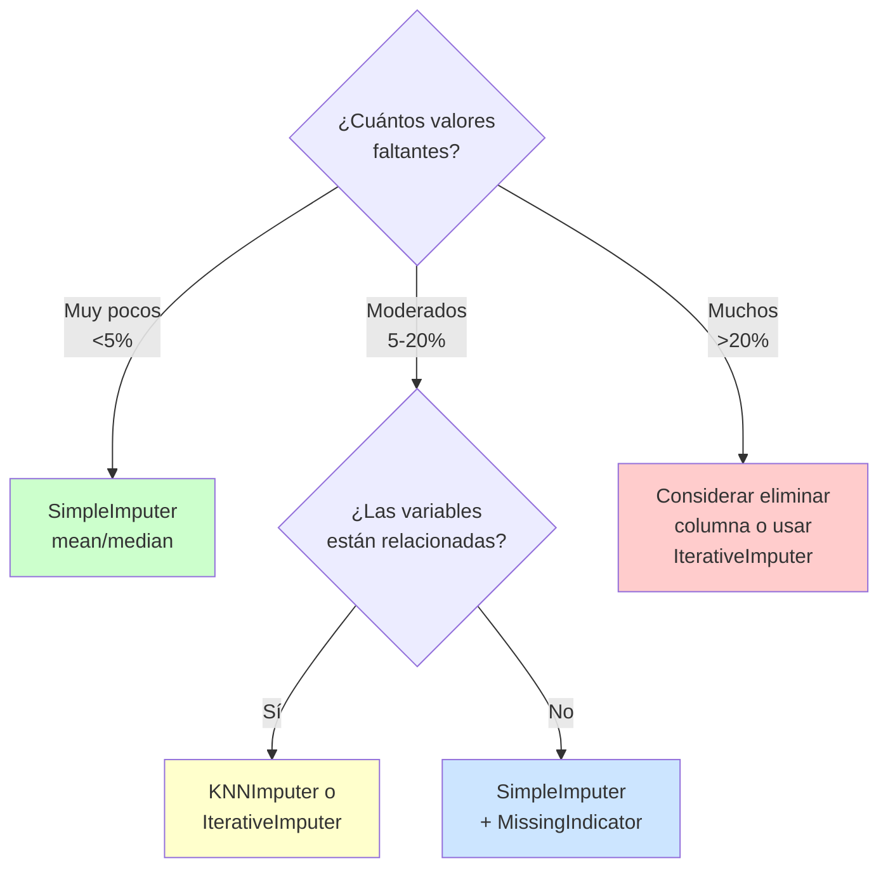

### Tabla Comparativa Completa

| Método | Velocidad | Precisión | Complejidad | Mejor Para |
|--------|-----------|-----------|-------------|------------|
| **SimpleImputer** | ⚡⚡⚡ Muy rápido | ⭐⭐ Básica | 🟢 Simple | Pocos NaN, exploración rápida |
| **KNNImputer** | ⚡⚡ Moderado | ⭐⭐⭐ Buena | 🟡 Media | Variables correlacionadas, datasets medianos |
| **IterativeImputer** | ⚡ Lento | ⭐⭐⭐⭐ Excelente | 🔴 Compleja | Máxima precisión, relaciones complejas |
| **MissingIndicator** | ⚡⚡⚡ Muy rápido | N/A | 🟢 Simple | Preservar info de ausencia + otro método |

---

## Codificación de Variables Categóricas

### ¿Por qué codificar?

Los algoritmos de machine learning trabajan con **números**, no con texto. Necesitamos convertir variables categóricas como "Rojo", "Azul", "Verde" en representaciones numéricas.

### Tipos de Variables Categóricas

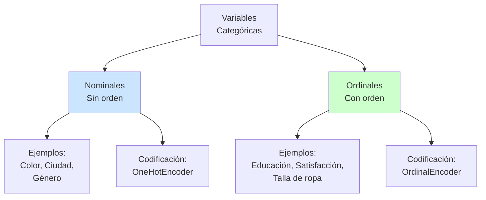

---

### 1. LabelEncoder (Codificación de Etiquetas)

**Concepto**: Convierte cada categoría única en un **número entero** (0, 1, 2, ...).

⚠️ **IMPORTANTE**: Solo para la **variable objetivo (y)**, NO para características (X).

#### ¿Por qué no usar LabelEncoder en características?

```
Problema: LabelEncoder introduce orden artificial

Categorías: ["Rojo", "Verde", "Azul"]
LabelEncoder: [0, 1, 2]

❌ El modelo pensará: Verde (1) está "entre" Rojo (0) y Azul (2)
❌ El modelo pensará: Azul (2) > Verde (1) > Rojo (0)
❌ Introduce relaciones matemáticas falsas
```

#### Código con scikit-learn

```python
from sklearn.preprocessing import LabelEncoder

# CORRECTO: Para variable objetivo
y = ['gato', 'perro', 'gato', 'pájaro']
le = LabelEncoder()
y_encoded = le.fit_transform(y)
# Resultado: [0, 1, 0, 2]

# Ver el mapeo
print(le.classes_)  # ['gato', 'pájaro', 'perro']

# Decodificar
y_original = le.inverse_transform([0, 1, 2])
# Resultado: ['gato', 'pájaro', 'perro']
```

---

### 2. OrdinalEncoder (Codificación Ordinal)

**Concepto**: Similar a LabelEncoder pero para **variables ordinales** en características (X). Respeta el **orden natural** de las categorías.

#### ¿Cuándo Usar?

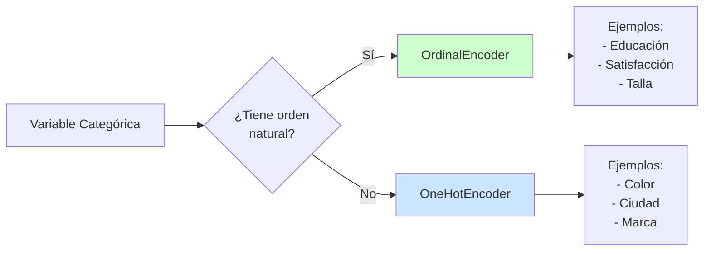

#### Ejemplo Visual

```
Variable: Educación

Categorías con orden:
["Primaria", "Secundaria", "Universidad", "Posgrado"]

OrdinalEncoder con categories especificadas:
[0, 1, 2, 3]

✅ El orden es correcto: 3 > 2 > 1 > 0
✅ El modelo entiende que Posgrado > Universidad
```

#### Código con scikit-learn

```python
from sklearn.preprocessing import OrdinalEncoder
import numpy as np

# Datos con variables ordinales
X = [['male', 'from US', 'uses Safari'],
     ['female', 'from Europe', 'uses Firefox']]

# Codificación automática (orden alfabético)
enc = OrdinalEncoder()
X_encoded = enc.fit_transform(X)

# Codificación con orden ESPECÍFICO (recomendado para ordinales)
education = ['Primaria', 'Secundaria', 'Universidad', 'Posgrado']
satisfaction = ['Muy Insatisfecho', 'Insatisfecho', 'Neutral', 'Satisfecho', 'Muy Satisfecho']

enc_ordinal = OrdinalEncoder(categories=[education, satisfaction])
X_ordinal = [['Secundaria', 'Satisfecho'],
             ['Universidad', 'Muy Satisfecho']]
X_encoded = enc_ordinal.fit_transform(X_ordinal)
# Resultado: [[1., 3.], [2., 4.]]

# Manejo de valores faltantes
X_with_nan = [['male'], ['female'], [np.nan], ['female']]
enc_nan = OrdinalEncoder(encoded_missing_value=-1)
X_encoded_nan = enc_nan.fit_transform(X_with_nan)
# NaN se codifica como -1

# Manejo de categorías desconocidas
enc_unknown = OrdinalEncoder(
    handle_unknown='use_encoded_value',
    unknown_value=999
)
```

#### Parámetros Importantes

| Parámetro | Descripción | Ejemplo |
|-----------|-------------|---------|
| `categories` | Lista de categorías en orden | `[['bajo', 'medio', 'alto']]` |
| `handle_unknown` | Cómo manejar categorías nuevas | `'error'`, `'use_encoded_value'` |
| `unknown_value` | Valor para categorías desconocidas | `999`, `-1` |
| `encoded_missing_value` | Valor para NaN | `-1`, `999` |

---

### 3. OneHotEncoder (Codificación One-Hot)

**Concepto**: Crea una **columna binaria (0/1) por cada categoría**. No introduce orden artificial.

#### ¿Cómo Funciona?

```
Variable: Color
Categorías: ["Rojo", "Verde", "Azul"]

Dataset Original:
┌───────┐
│ Color │
├───────┤
│ Rojo  │
│ Verde │
│ Azul  │
│ Rojo  │
└───────┘

Después de OneHotEncoder:
┌───────┬───────┬───────┐
│ Rojo  │ Verde │ Azul  │
├───────┼───────┼───────┤
│   1   │   0   │   0   │
│   0   │   1   │   0   │
│   0   │   0   │   1   │
│   1   │   0   │   0   │
└───────┴───────┴───────┘

✅ No hay orden implícito
✅ Cada categoría es independiente
```

#### Código con scikit-learn

```python
from sklearn.preprocessing import OneHotEncoder

# Datos categóricos
X = [['male', 'from US', 'uses Safari'],
     ['female', 'from Europe', 'uses Firefox']]

# OneHotEncoder básico
enc = OneHotEncoder()
X_encoded = enc.fit_transform(X)
# Resultado: sparse matrix (eficiente para muchas categorías)

# OneHotEncoder con array denso
enc_dense = OneHotEncoder(sparse_output=False)
X_encoded_dense = enc_dense.fit_transform(X)

# Ver las categorías
print(enc.categories_)
# [array(['female', 'male'], dtype=object),
#  array(['from Europe', 'from US'], dtype=object),
#  array(['uses Firefox', 'uses Safari'], dtype=object)]

# Obtener nombres de columnas
print(enc.get_feature_names_out())
# ['x0_female', 'x0_male', 'x1_from Europe', 'x1_from US', ...]
```

#### Problema: Multicolinealidad (Dummy Variable Trap)

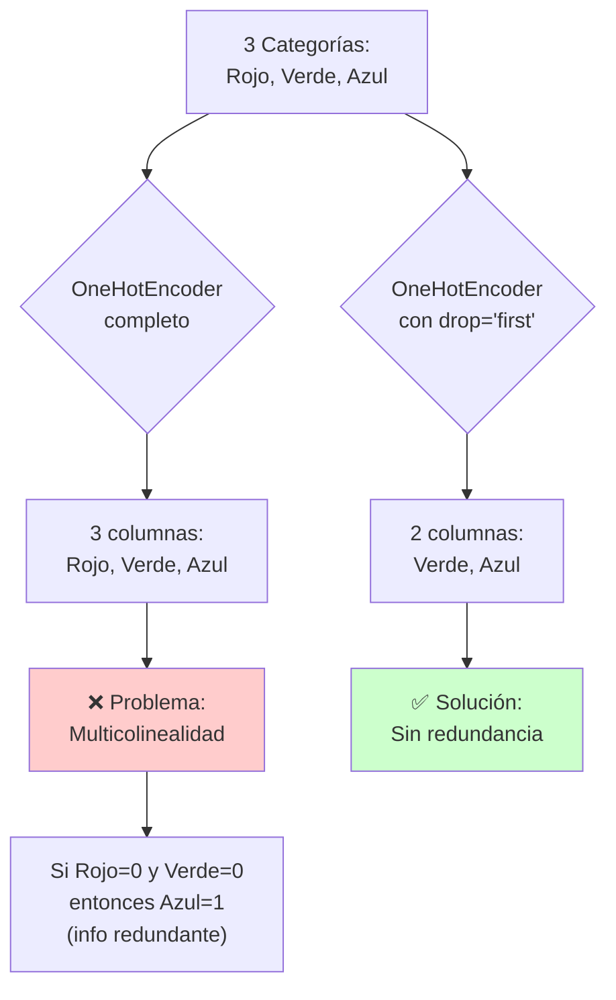

#### Código con drop='first'

```python
# Evitar multicolinealidad eliminando la primera categoría
enc_drop = OneHotEncoder(drop='first', sparse_output=False)
X_encoded = enc_drop.fit_transform(X)
# Si antes tenías 3 columnas por categoría, ahora tendrás 2
```

#### Manejo de Categorías Poco Frecuentes

```python
# Agrupar categorías poco frecuentes (aparecen < 6 veces)
X = np.array([['dog'] * 5 + ['cat'] * 20 + ['rabbit'] * 10 + ['snake'] * 3],
             dtype=object).T

enc_infrequent = OneHotEncoder(min_frequency=6, sparse_output=False)
enc_infrequent.fit(X)

# Ver categorías poco frecuentes
print(enc_infrequent.infrequent_categories_)
# [array(['dog', 'snake'], dtype=object)]

# Resultado: dog y snake se agrupan en una categoría "infrequent"
```

#### Manejo de Categorías Desconocidas

```python
# Opción 1: Error (default)
enc_error = OneHotEncoder(handle_unknown='error')

# Opción 2: Ignorar (codificar como todos ceros)
enc_ignore = OneHotEncoder(handle_unknown='ignore')
X_test = [['female', 'from Asia', 'uses Chrome']]  # 'from Asia' es nueva
X_encoded = enc_ignore.transform(X_test)
# from Asia → [0, 0] (ni Europe ni US)

# Opción 3: Tratar como categoría poco frecuente
enc_infrequent_unknown = OneHotEncoder(
    handle_unknown='infrequent_if_exist',
    min_frequency=5
)
```

#### Ventajas y Desventajas

| ✅ Ventajas | ❌ Desventajas |
|------------|----------------|
| No introduce orden artificial | Aumenta dimensionalidad |
| Cada categoría es independiente | No funciona bien con alta cardinalidad |
| Funciona con categorías nominales | Puede crear sparse matrices grandes |
| Interpretable | Curse of dimensionality |

---

### 4. TargetEncoder (Codificación por Objetivo)

**Concepto**: Reemplaza cada categoría por la **media de la variable objetivo** para esa categoría. Útil para variables categóricas con **alta cardinalidad** (muchas categorías únicas).

#### ¿Cómo Funciona?

```
Dataset:
┌────────┬──────────┐
│ Ciudad │ Survived │
├────────┼──────────┤
│ Paris  │    1     │
│ London │    0     │
│ Paris  │    1     │
│ London │    0     │
│ Paris  │    0     │
│ Berlin │    1     │
└────────┴──────────┘

TargetEncoder:
- Paris  → (1 + 1 + 0) / 3 = 0.667
- London → (0 + 0) / 2 = 0.000
- Berlin → 1 / 1 = 1.000

Resultado:
┌────────────┬──────────┐
│ Ciudad_enc │ Survived │
├────────────┼──────────┤
│   0.667    │    1     │
│   0.000    │    0     │
│   0.667    │    1     │
│   0.000    │    0     │
│   0.667    │    0     │
│   1.000    │    1     │
└────────────┴──────────┘
```

#### ⚠️ Riesgo: Target Leakage y Overfitting

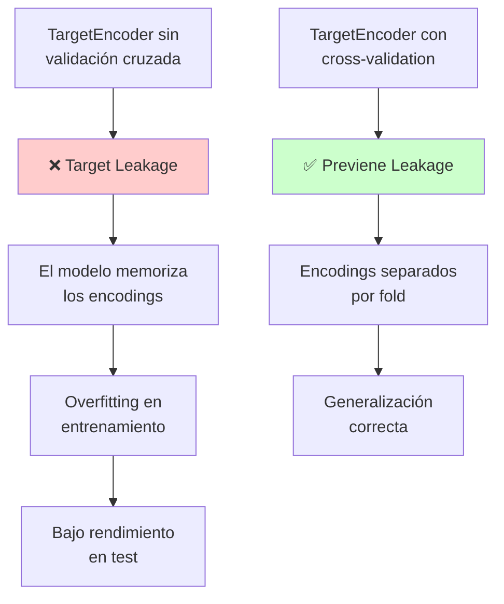

#### Código con scikit-learn

```python
from sklearn.preprocessing import TargetEncoder

X = [['dog'], ['cat'], ['dog'], ['cat'], ['dog']]
y = [90, 80, 75, 60, 70]

# TargetEncoder básico
enc = TargetEncoder()
X_encoded = enc.fit_transform(X, y)
# dog → (90 + 75 + 70) / 3 = 78.33
# cat → (80 + 60) / 2 = 70.00

# Con cross-validation para evitar overfitting (RECOMENDADO)
from sklearn.model_selection import cross_val_score
from sklearn.pipeline import Pipeline
from sklearn.linear_model import LogisticRegression

pipeline = Pipeline([
    ('encoder', TargetEncoder()),
    ('classifier', LogisticRegression())
])

# El encoder se ajustará correctamente en cada fold
scores = cross_val_score(pipeline, X, y, cv=5)
```

#### Ventajas y Desventajas

| ✅ Ventajas | ❌ Desventajas |
|------------|----------------|
| Funciona con alta cardinalidad | Riesgo de target leakage |
| No aumenta dimensionalidad | Puede overfit |
| Captura relación con el target | Solo para target numérico |
| Eficiente en memoria | Requiere cross-validation |

---

### Comparación de Métodos de Codificación

#### Tabla Comparativa

| Método | Variables | Dimensiones | Orden | Cardinalidad | Uso Principal |
|--------|-----------|-------------|-------|--------------|---------------|
| **LabelEncoder** | Target (y) | ✅ No aumenta | ⚠️ Introduce | Cualquiera | Variable objetivo |
| **OrdinalEncoder** | Ordinales | ✅ No aumenta | ✅ Respeta | Cualquiera | Educación, satisfacción |
| **OneHotEncoder** | Nominales | ❌ Aumenta mucho | ✅ No introduce | Baja-Media | Color, ciudad, género |
| **TargetEncoder** | Nominales | ✅ No aumenta | N/A | Alta | Códigos postales, IDs |

#### Diagrama de Decisión

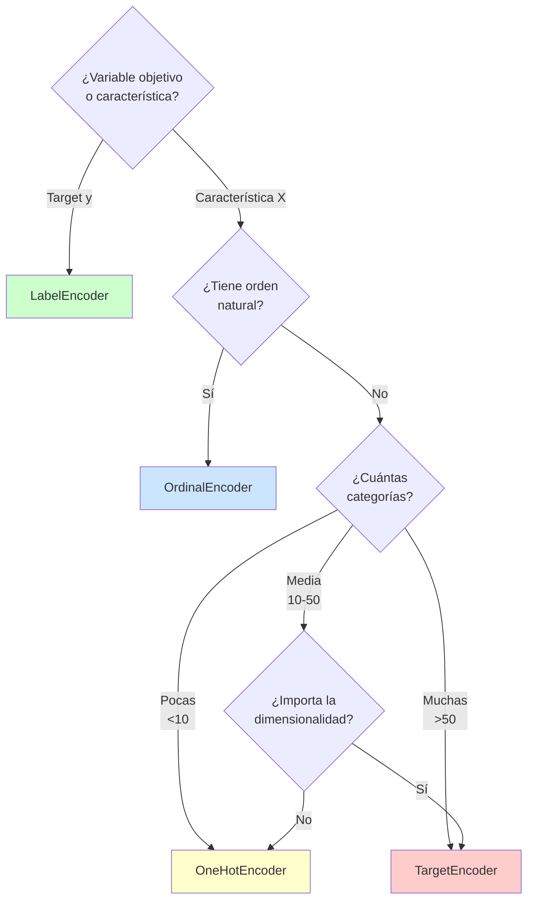

---

## Escalado y Normalización

### ¿Por qué escalar?

Muchos algoritmos de ML son **sensibles a la escala** de las características:

```
Sin Escalar:
┌──────┬────────┐
│ Age  │ Salary │
├──────┼────────┤
│  25  │ 50000  │
│  30  │ 60000  │
│  45  │ 100000 │
└──────┴────────┘

Problema: Salary domina porque sus valores son ~1000x más grandes
```

### Algoritmos Sensibles a la Escala

| Sensibles | No Sensibles |
|-----------|--------------|
| K-Nearest Neighbors (KNN) | Árboles de Decisión |
| Support Vector Machines (SVM) | Random Forest |
| Regresión Logística/Lineal | XGBoost |
| Redes Neuronales | LightGBM |
| K-Means Clustering | CatBoost |
| PCA | Naive Bayes |

---

### 1. StandardScaler (Estandarización Z-score)

**Concepto**: Transforma datos para que tengan **media = 0** y **desviación estándar = 1**.

**Fórmula**:
```
z = (x - μ) / σ

donde:
- x = valor original
- μ = media de la columna
- σ = desviación estándar
```

#### Ejemplo Visual

```
Datos Originales:
[10, 20, 30, 40, 50]
μ = 30, σ = 15.81

Después de StandardScaler:
[-1.26, -0.63, 0.00, 0.63, 1.26]
μ = 0, σ = 1
```

#### Visualización

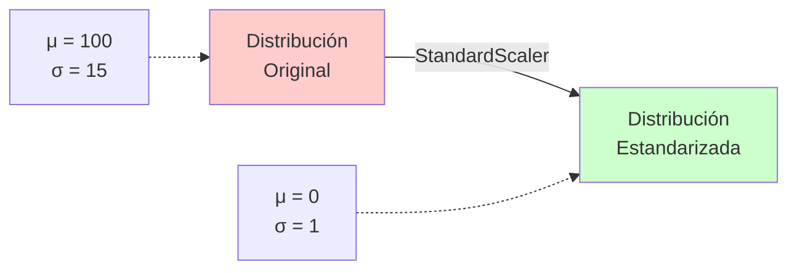

#### Código con scikit-learn

```python
from sklearn.preprocessing import StandardScaler
import numpy as np

X = np.array([[1., -1., 2.],
              [2., 0., 0.],
              [0., 1., -1.]])

scaler = StandardScaler()
X_scaled = scaler.fit_transform(X)

# Ver media y desviación estándar aprendidas
print(scaler.mean_)  # [1., 0., 0.33]
print(scaler.scale_) # [0.816, 0.816, 1.247]

# Aplicar a datos nuevos
X_test = np.array([[-1., 1., 0.]])
X_test_scaled = scaler.transform(X_test)
```

#### Cuándo Usar

| ✅ Usar | ❌ No Usar |
|--------|-----------|
| SVM, Regresión Logística | Árboles, Random Forest |
| Redes Neuronales | Datos con muchos outliers |
| PCA | Variables ya en [0, 1] |
| Datos con distribución normal | |

---

### 2. MinMaxScaler (Normalización Min-Max)

**Concepto**: Escala datos al rango **[0, 1]** (o cualquier rango personalizado).

**Fórmula**:
```
x_scaled = (x - x_min) / (x_max - x_min)
```

#### Ejemplo Visual

```
Datos Originales:
[10, 20, 30, 40, 50]
min = 10, max = 50

Después de MinMaxScaler:
[0.0, 0.25, 0.5, 0.75, 1.0]
min = 0, max = 1
```

#### Código con scikit-learn

```python
from sklearn.preprocessing import MinMaxScaler

X = np.array([[1., -1., 2.],
              [2., 0., 0.],
              [0., 1., -1.]])

scaler = MinMaxScaler()
X_scaled = scaler.fit_transform(X)

# Ver mín y máx aprendidos
print(scaler.data_min_)  # [0., -1., -1.]
print(scaler.data_max_)  # [2., 1., 2.]

# Escalar a rango personalizado [0, 10]
scaler_custom = MinMaxScaler(feature_range=(0, 10))
X_scaled_custom = scaler_custom.fit_transform(X)
```

#### Ventajas y Desventajas

| ✅ Ventajas | ❌ Desventajas |
|------------|----------------|
| Mantiene forma de distribución | Muy sensible a outliers |
| Todos los valores en [0, 1] | No mantiene media = 0 |
| Interpretable | Afecta mucho la escala |
| Funciona bien con redes neuronales | |

---

### 3. MaxAbsScaler

**Concepto**: Escala dividiendo por el **valor absoluto máximo**. Resultado: rango **[-1, 1]**.

**Fórmula**:
```
x_scaled = x / max(|x|)
```

#### Ventaja Principal

✅ **Preserva la esparsidad** (mantiene los ceros como ceros)
✅ Útil para **datos sparse** (matrices con muchos ceros)

#### Código con scikit-learn

```python
from sklearn.preprocessing import MaxAbsScaler

X = np.array([[1., -1., 2.],
              [2., 0., 0.],
              [0., 1., -1.]])

scaler = MaxAbsScaler()
X_scaled = scaler.fit_transform(X)
# Resultado: [[0.5, -1., 1.],
#             [1., 0., 0.],
#             [0., 1., -0.5]]

# Ver el máximo absoluto por columna
print(scaler.scale_)  # [2., 1., 2.]
```

#### Cuándo Usar

- Datos ya centrados en cero
- Matrices sparse (muchos ceros)
- Datos de sensores (positivos y negativos)

---

### 4. RobustScaler

**Concepto**: Usa la **mediana** y el **rango intercuartílico (IQR)** en lugar de media y desviación estándar. **Robusto a outliers**.

**Fórmula**:
```
x_scaled = (x - mediana) / IQR

donde IQR = Q3 - Q1
```

#### ¿Por qué es robusto?

```
Datos con outlier:
[1, 2, 3, 4, 5, 100]

StandardScaler:
- Afectado por 100 (outlier)
- μ = 19.17, σ = 38.7

RobustScaler:
- No afectado por 100
- mediana = 3.5, IQR = 3
```

#### Código con scikit-learn

```python
from sklearn.preprocessing import RobustScaler

X = np.array([[1., -1., 2.],
              [2., 0., 0.],
              [0., 1., -1.]])

scaler = RobustScaler()
X_scaled = scaler.fit_transform(X)

# Ver mediana y IQR
print(scaler.center_)  # Mediana por columna
print(scaler.scale_)   # IQR por columna
```

#### Cuándo Usar

| ✅ Usar | ❌ No Usar |
|--------|-----------|
| Datos con outliers | Datos limpios sin outliers |
| Distribuciones sesgadas | Cuando necesitas media = 0 |
| Datos financieros | Datasets pequeños |

---

### 5. Normalizer

**Concepto**: Normaliza **cada muestra (fila)** para que tenga **norma unitaria**. Diferente a los demás (escala por fila, no por columna).

**Fórmula**:
```
Para norma L2:
x_normalized = x / ||x||

donde ||x|| = sqrt(x₁² + x₂² + ... + xₙ²)
```

#### Ejemplo Visual

```
Muestra original: [3, 4]
Norma L2: sqrt(3² + 4²) = sqrt(25) = 5

Normalizada: [3/5, 4/5] = [0.6, 0.8]
Nueva norma: sqrt(0.6² + 0.8²) = 1.0 ✅
```

#### Código con scikit-learn

```python
from sklearn.preprocessing import Normalizer

X = np.array([[4, 1, 2, 2],
              [1, 3, 9, 3],
              [5, 7, 5, 1]])

# Norma L2 (default)
normalizer_l2 = Normalizer(norm='l2')
X_normalized_l2 = normalizer_l2.fit_transform(X)

# Norma L1
normalizer_l1 = Normalizer(norm='l1')
X_normalized_l1 = normalizer_l1.fit_transform(X)

# Norma Max
normalizer_max = Normalizer(norm='max')
X_normalized_max = normalizer_max.fit_transform(X)
```

#### Cuándo Usar

- Sistemas de recomendación
- Similitud de coseno
- Análisis de texto (TF-IDF)
- Cuando la magnitud no importa, solo la dirección

---

### Comparación de Métodos de Escalado

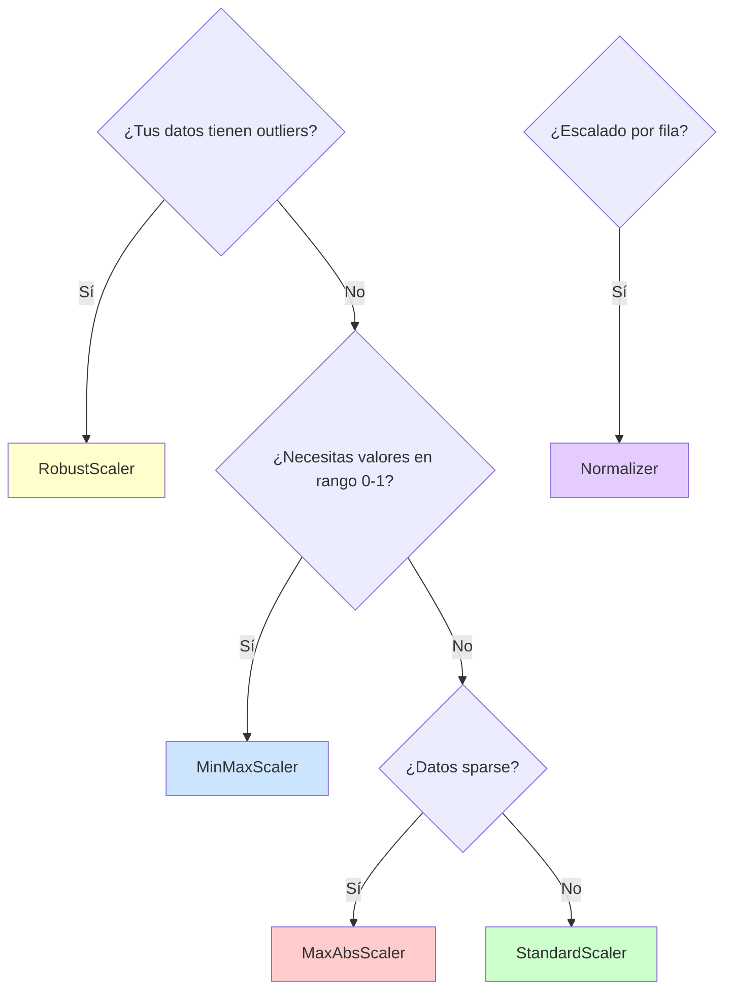

### Tabla Resumen

| Método | Rango Resultado | Outliers | Sparse | Uso Principal |
|--------|----------------|----------|--------|---------------|
| **StandardScaler** | (-∞, +∞), μ=0, σ=1 | ❌ Sensible | ❌ No preserva | SVM, Redes Neuronales, PCA |
| **MinMaxScaler** | [0, 1] o custom | ❌ Muy sensible | ❌ No preserva | Imágenes, Redes Neuronales |
| **MaxAbsScaler** | [-1, 1] | ❌ Sensible | ✅ Preserva | Datos sparse, centrados en 0 |
| **RobustScaler** | (-∞, +∞) | ✅ Robusto | ❌ No preserva | Datos financieros, outliers |
| **Normalizer** | Norma = 1 | N/A | ✅ Puede preservar | Similitud, texto, recomendación |

---

## Reducción de Dimensionalidad: PCA

### ¿Qué es PCA?

**PCA (Principal Component Analysis)** es una técnica que reduce el número de características transformándolas en **componentes principales** que capturan la mayor varianza posible.

### Problema: Curse of Dimensionality

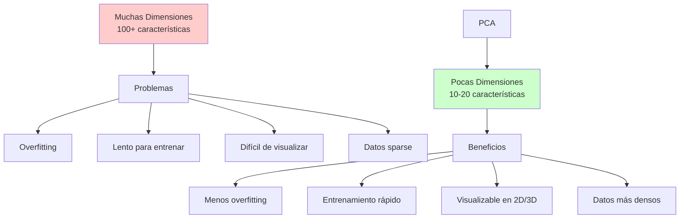

### ¿Cómo Funciona PCA Intuitivamente?

#### Analogía Visual

```
Imagina que tienes puntos en 2D:

    ↑ y
    │     *
    │   *   *
    │ *       *
    │*          *
    └──────────────→ x

PCA encuentra:
1. La dirección de MÁXIMA variación (PC1)
2. La dirección PERPENDICULAR con la siguiente mayor variación (PC2)

    ↑ PC2
    │
    │    / (PC1)
    │   /
    │  /
    │ /
    └──────────→

Proyección en PC1:
*----*--*---*----*-→ (1D, mantiene 90% de la info)
```

### Pasos del Algoritmo PCA

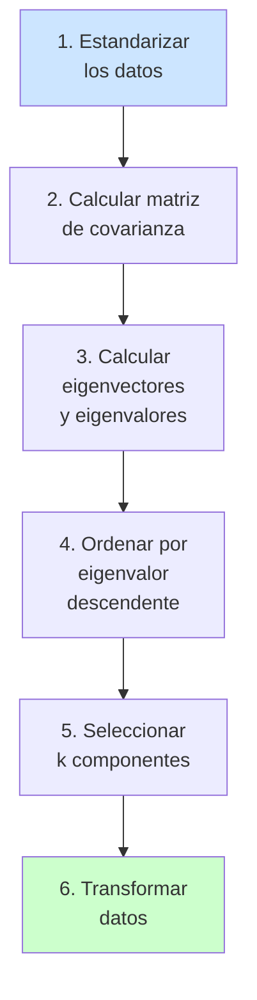

### Código con scikit-learn

```python
from sklearn.decomposition import PCA
from sklearn.preprocessing import StandardScaler
import numpy as np

# Datos de ejemplo: 4 características
X = np.array([[2.5, 2.4, 0.5, 1.0],
              [0.5, 0.7, 1.2, 0.8],
              [2.2, 2.9, 0.9, 1.5],
              [1.9, 2.2, 0.4, 0.9],
              [3.1, 3.0, 0.8, 1.8]])

# Paso 1: SIEMPRE estandarizar antes de PCA
scaler = StandardScaler()
X_scaled = scaler.fit_transform(X)

# Paso 2: Aplicar PCA
pca = PCA(n_components=2)  # Reducir a 2 dimensiones
X_pca = pca.fit_transform(X_scaled)

# Ver cuánta varianza explica cada componente
print("Varianza explicada:", pca.explained_variance_ratio_)
# Ej: [0.73, 0.22] → PC1 explica 73%, PC2 explica 22%

# Varianza acumulada
print("Varianza acumulada:", np.cumsum(pca.explained_variance_ratio_))
# Ej: [0.73, 0.95] → Con 2 componentes capturas 95% de la info

# Ver los componentes principales (direcciones)
print("Componentes:", pca.components_)
```

### Elegir el Número de Componentes

#### Método 1: Varianza Explicada

```python
# Ver varianza explicada por TODOS los componentes
pca_full = PCA()
pca_full.fit(X_scaled)

import matplotlib.pyplot as plt

plt.figure(figsize=(10, 5))

# Gráfico de codo (Scree Plot)
plt.subplot(1, 2, 1)
plt.plot(range(1, len(pca_full.explained_variance_ratio_) + 1),
         pca_full.explained_variance_ratio_, 'bo-')
plt.xlabel('Componente')
plt.ylabel('Varianza Explicada')
plt.title('Scree Plot')

# Gráfico acumulado
plt.subplot(1, 2, 2)
plt.plot(range(1, len(pca_full.explained_variance_ratio_) + 1),
         np.cumsum(pca_full.explained_variance_ratio_), 'ro-')
plt.axhline(y=0.95, color='g', linestyle='--', label='95% varianza')
plt.xlabel('Componente')
plt.ylabel('Varianza Acumulada')
plt.title('Varianza Acumulada')
plt.legend()

plt.show()
```

#### Método 2: Especificar Varianza Deseada

```python
# Mantener 95% de la varianza
pca_95 = PCA(n_components=0.95)
X_pca_95 = pca_95.fit_transform(X_scaled)

print(f"Dimensiones originales: {X.shape[1]}")
print(f"Dimensiones después de PCA: {X_pca_95.shape[1]}")
# Automáticamente selecciona el número mínimo de componentes
```

### Visualización de Resultados

```python
import matplotlib.pyplot as plt

# Visualizar en 2D
plt.figure(figsize=(8, 6))
plt.scatter(X_pca[:, 0], X_pca[:, 1], alpha=0.7)
plt.xlabel(f'PC1 ({pca.explained_variance_ratio_[0]:.2%} varianza)')
plt.ylabel(f'PC2 ({pca.explained_variance_ratio_[1]:.2%} varianza)')
plt.title('Datos proyectados en 2 componentes principales')
plt.grid(True)
plt.show()
```

### Invertir la Transformación

```python
# Reconstruir datos aproximados desde PCA
X_reconstructed = pca.inverse_transform(X_pca)

# Comparar con originales
reconstruction_error = np.mean((X_scaled - X_reconstructed) ** 2)
print(f"Error de reconstrucción: {reconstruction_error:.6f}")
```

### Ventajas y Desventajas de PCA

| ✅ Ventajas | ❌ Desventajas |
|------------|----------------|
| Reduce dimensionalidad | Pérdida de información |
| Elimina multicolinealidad | Componentes no interpretables |
| Acelera entrenamiento | Asume linealidad |
| Reduce overfitting | Sensible a escala (requiere estandarización) |
| Visualización en 2D/3D | No funciona con datos categóricos |

### Cuándo Usar PCA

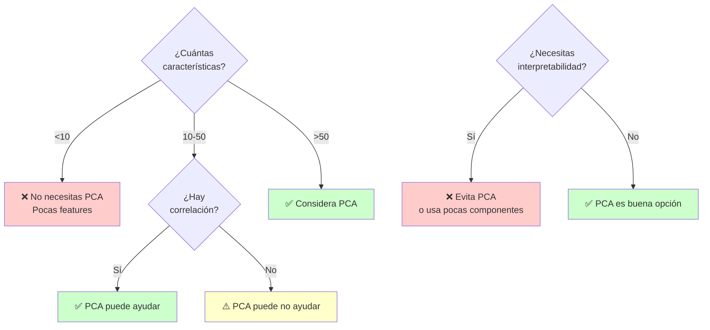

### Casos de Uso Comunes

1. **Visión por Computadora**: Reducir imágenes de 784 píxeles (28×28) a 50 componentes
2. **Análisis Genético**: Miles de genes → decenas de componentes
3. **Finanzas**: Múltiples indicadores económicos → pocos factores
4. **Procesamiento de Señales**: Compresión de datos de sensores

---

## Feature Engineering

### ¿Qué es Feature Engineering?

**Feature Engineering** es el proceso de **crear, transformar o seleccionar** características para mejorar el rendimiento de los modelos.

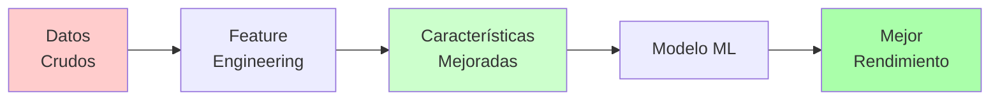

### Tipos de Feature Engineering

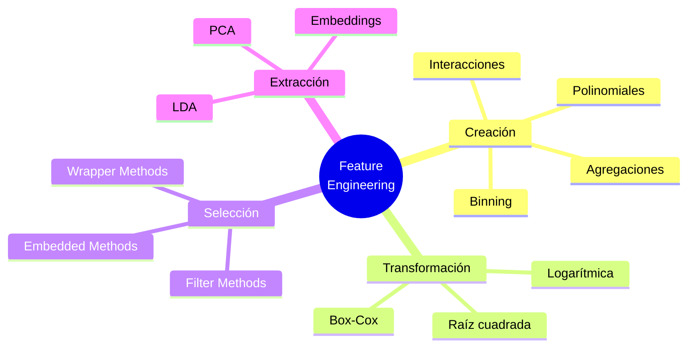

---

### 1. Creación de Features: Interacciones

**Concepto**: Combinar dos o más características para capturar relaciones.

#### Ejemplo

```python
# Dataset: Precio de casas
┌──────┬────────┐
│ Area │ Rooms  │
├──────┼────────┤
│ 100  │   3    │
│ 150  │   4    │
└──────┴────────┘

# Feature Engineering: Crear "Area por habitación"
┌──────┬────────┬─────────────┐
│ Area │ Rooms  │ Area_per_room│
├──────┼────────┼─────────────┤
│ 100  │   3    │   33.33     │
│ 150  │   4    │   37.50     │
└──────┴────────┴─────────────┘
```

#### Código

```python
import pandas as pd

# Crear interacciones manualmente
df['Area_per_room'] = df['Area'] / df['Rooms']
df['Total_space'] = df['Area'] + df['Garden_area']
df['Price_per_sqm'] = df['Price'] / df['Area']

# Interacciones automáticas con PolynomialFeatures
from sklearn.preprocessing import PolynomialFeatures

X = df[['Area', 'Rooms']]
poly = PolynomialFeatures(degree=2, include_bias=False)
X_poly = poly.fit_transform(X)

# Genera: [Area, Rooms, Area², Area×Rooms, Rooms²]
print(poly.get_feature_names_out())
```

---

### 2. Binning (Discretización)

**Concepto**: Convertir variables continuas en **grupos** o **bins**.

#### ¿Por qué?

- Captura relaciones no lineales
- Reduce efecto de outliers
- A veces mejora interpretabilidad

#### Ejemplo Visual

```
Edad continua: [18, 25, 32, 45, 67, 72]

Después de Binning:
┌─────────────┬─────────┐
│ Rango Edad  │ Bin     │
├─────────────┼─────────┤
│ 18-30       │ Joven   │
│ 31-50       │ Adulto  │
│ 51+         │ Senior  │
└─────────────┴─────────┘
```

#### Código con scikit-learn

```python
from sklearn.preprocessing import KBinsDiscretizer
import numpy as np

X = np.array([[18], [25], [32], [45], [67], [72]])

# Binning en 3 grupos con estrategia "uniform" (rangos iguales)
discretizer = KBinsDiscretizer(n_bins=3, encode='ordinal', strategy='uniform')
X_binned = discretizer.fit_transform(X)

# Estrategias disponibles:
# - 'uniform': Rangos de igual ancho
# - 'quantile': Bins con igual número de muestras
# - 'kmeans': Bins basados en K-means
```

---

### 3. Transformaciones Matemáticas

#### Logarítmica

**Cuándo usar**: Datos con **distribución sesgada** (skewed) o con valores muy grandes.

```python
# Variable con distribución exponencial
df['Income_log'] = np.log1p(df['Income'])  # log1p = log(1 + x)
```

#### Box-Cox

**Cuándo usar**: Para hacer datos **más normales**.

```python
from scipy.stats import boxcox

# Transforma datos a distribución más normal
df['Feature_boxcox'], lambda_param = boxcox(df['Feature'] + 1)
# Nota: Feature debe ser > 0
```

#### Visualización del Efecto

```
Antes (Skewed):        Después (Normalizada):
    ▂▄▇█▅▃▂▁               ▁▃▅▇█▇▅▃▁
```

---

### 4. Features Temporales

**Concepto**: Extraer información de fechas.

```python
import pandas as pd

df['Date'] = pd.to_datetime(df['Date'])

# Extraer componentes
df['Year'] = df['Date'].dt.year
df['Month'] = df['Date'].dt.month
df['Day'] = df['Date'].dt.day
df['DayOfWeek'] = df['Date'].dt.dayofweek
df['Quarter'] = df['Date'].dt.quarter
df['IsWeekend'] = df['DayOfWeek'].isin([5, 6]).astype(int)

# Features cíclicas (mantienen continuidad)
df['Month_sin'] = np.sin(2 * np.pi * df['Month'] / 12)
df['Month_cos'] = np.cos(2 * np.pi * df['Month'] / 12)
```

**¿Por qué cíclicas?**

```
Problema: Diciembre (12) y Enero (1) están lejos numéricamente
Solución: sin/cos hacen que 12 y 1 estén cerca en el círculo

    12 ← → 1
    ↑     ↓
    11 → 2
```

---

### 5. Agregaciones

**Concepto**: Crear estadísticas resumidas.

```python
# Por grupos
df['Avg_price_by_city'] = df.groupby('City')['Price'].transform('mean')
df['Max_price_by_city'] = df.groupby('City')['Price'].transform('max')
df['Count_by_city'] = df.groupby('City')['Price'].transform('count')

# Rolling (ventanas móviles)
df['Sales_rolling_7d'] = df['Sales'].rolling(window=7).mean()
df['Sales_rolling_30d'] = df['Sales'].rolling(window=30).mean()
```

---

### 6. Target Encoding (ya visto)

Ver sección de [TargetEncoder](#4-targetencoder-codificación-por-objetivo).

---

### Selección de Features

#### ¿Por qué seleccionar?

- ❌ Más features ≠ mejor modelo
- ✅ Menos features = menos overfitting, más rápido

#### Métodos

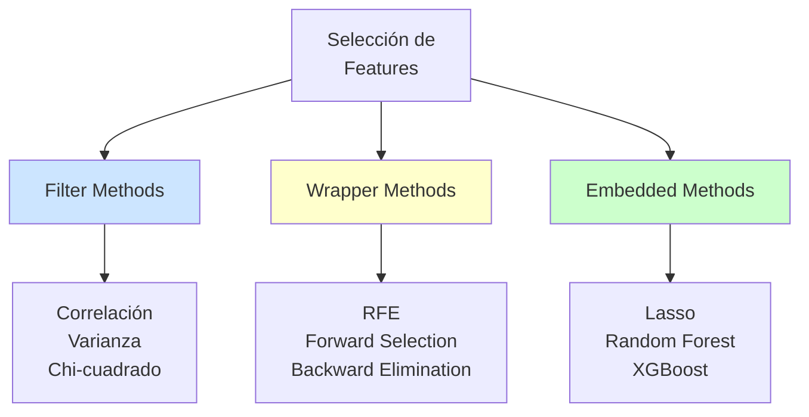

#### 1. Filter Methods: Correlación

```python
# Eliminar features con baja correlación con el target
correlation = df.corr()['target'].abs().sort_values(ascending=False)
selected_features = correlation[correlation > 0.1].index.tolist()

# Eliminar features altamente correlacionadas entre sí
correlation_matrix = df.corr().abs()
upper_triangle = correlation_matrix.where(
    np.triu(np.ones(correlation_matrix.shape), k=1).astype(bool)
)
to_drop = [col for col in upper_triangle.columns if any(upper_triangle[col] > 0.95)]
df_filtered = df.drop(columns=to_drop)
```

#### 2. Wrapper Methods: RFE

```python
from sklearn.feature_selection import RFE
from sklearn.ensemble import RandomForestClassifier

# Selección recursiva de features
model = RandomForestClassifier()
rfe = RFE(estimator=model, n_features_to_select=10)
rfe.fit(X, y)

# Ver features seleccionadas
selected_features = X.columns[rfe.support_]
print(selected_features)
```

#### 3. Embedded Methods: Feature Importance

```python
from sklearn.ensemble import RandomForestClassifier

# Entrenar modelo
model = RandomForestClassifier()
model.fit(X, y)

# Ver importancias
importances = pd.DataFrame({
    'feature': X.columns,
    'importance': model.feature_importances_
}).sort_values('importance', ascending=False)

# Seleccionar top 10
top_features = importances.head(10)['feature'].tolist()
```

---

### Pipeline Completo de Feature Engineering

```python
from sklearn.pipeline import Pipeline
from sklearn.preprocessing import StandardScaler, PolynomialFeatures
from sklearn.decomposition import PCA
from sklearn.ensemble import RandomForestClassifier

# Pipeline completo
pipeline = Pipeline([
    ('poly', PolynomialFeatures(degree=2)),
    ('scaler', StandardScaler()),
    ('pca', PCA(n_components=0.95)),
    ('classifier', RandomForestClassifier())
])

pipeline.fit(X_train, y_train)
predictions = pipeline.predict(X_test)
```

---

## Preprocesamiento de Texto

### Flujo Típico

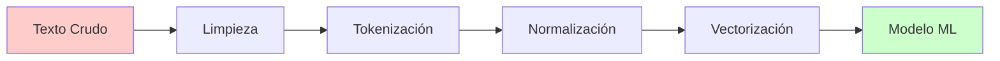

### Técnicas Comunes

#### 1. Limpieza

```python
import re

def clean_text(text):
    # Minúsculas
    text = text.lower()

    # Eliminar URLs
    text = re.sub(r'http\S+|www\S+', '', text)

    # Eliminar menciones y hashtags
    text = re.sub(r'@\w+|#\w+', '', text)

    # Eliminar puntuación
    text = re.sub(r'[^\w\s]', '', text)

    # Eliminar números
    text = re.sub(r'\d+', '', text)

    # Eliminar espacios múltiples
    text = re.sub(r'\s+', ' ', text).strip()

    return text

text = "Check out https://example.com! @user #AI is awesome!!!"
clean_text(text)
# Resultado: "check out is awesome"
```

#### 2. Tokenización

```python
from sklearn.feature_extraction.text import CountVectorizer

# Tokenización simple
text = "El machine learning es fascinante"
tokens = text.split()  # ['El', 'machine', 'learning', 'es', 'fascinante']

# Con CountVectorizer
vectorizer = CountVectorizer()
X = vectorizer.fit_transform([text])
print(vectorizer.get_feature_names_out())
```

#### 3. Stopwords (Palabras Vacías)

```python
from sklearn.feature_extraction.text import CountVectorizer

# Eliminar stopwords en español
vectorizer = CountVectorizer(stop_words='english')  # Para inglés

# Stopwords personalizadas
custom_stopwords = ['el', 'la', 'de', 'en', 'es', 'un', 'una']
vectorizer = CountVectorizer(stop_words=custom_stopwords)
```

#### 4. N-gramas

```python
from sklearn.feature_extraction.text import CountVectorizer

# Unigramas (palabras individuales)
vectorizer_1 = CountVectorizer(ngram_range=(1, 1))

# Bigramas
vectorizer_2 = CountVectorizer(ngram_range=(2, 2))

# Unigramas + Bigramas
vectorizer_12 = CountVectorizer(ngram_range=(1, 2))

text = ["machine learning is great"]
X = vectorizer_2.fit_transform(text)
print(vectorizer_2.get_feature_names_out())
# ['machine learning', 'learning is', 'is great']
```

#### 5. TF-IDF

**Concepto**: Da más peso a palabras **importantes** y menos a palabras **comunes**.

```
TF (Term Frequency): Frecuencia de palabra en documento
IDF (Inverse Document Frequency): Rareza de palabra en corpus

TF-IDF = TF × IDF
```

```python
from sklearn.feature_extraction.text import TfidfVectorizer

documents = [
    "machine learning is great",
    "deep learning is powerful",
    "learning is fun"
]

vectorizer = TfidfVectorizer()
X = vectorizer.fit_transform(documents)

# Ver matriz TF-IDF
import pandas as pd
df = pd.DataFrame(X.toarray(), columns=vectorizer.get_feature_names_out())
print(df)
```

### Librerías Populares

| Librería | Uso Principal |
|----------|---------------|
| **NLTK** | Tokenización, stemming, POS tagging |
| **spaCy** | NLP avanzado, rápido, eficiente |
| **TextBlob** | Análisis de sentimientos, simple |
| **Gensim** | Topic modeling, Word2Vec |
| **Transformers** | BERT, GPT, modelos pre-entrenados |

---

## Preprocesamiento de Imágenes

### Flujo Típico

```mermaid
graph LR
    A[Imagen Cruda] --> B[Carga]
    B --> C[Redimensionamiento]
    C --> D[Normalización]
    D --> E[Aumento de Datos]
    E --> F[Modelo ML]

    style A fill:#ffcccc
    style F fill:#ccffcc
```

### Técnicas Comunes

#### 1. Carga y Redimensionamiento

```python
from PIL import Image
import numpy as np

# Cargar imagen
img = Image.open('image.jpg')

# Redimensionar
img_resized = img.resize((224, 224))  # Tamaño común para CNNs

# Convertir a array numpy
img_array = np.array(img_resized)
print(img_array.shape)  # (224, 224, 3) para RGB
```

#### 2. Normalización

```python
# Normalizar a [0, 1]
img_normalized = img_array / 255.0

# Estandarizar (ImageNet stats)
mean = np.array([0.485, 0.456, 0.406])
std = np.array([0.229, 0.224, 0.225])
img_standardized = (img_normalized - mean) / std
```

#### 3. Data Augmentation (Aumento de Datos)

```python
from tensorflow.keras.preprocessing.image import ImageDataGenerator

datagen = ImageDataGenerator(
    rotation_range=20,        # Rotar ±20 grados
    width_shift_range=0.2,    # Desplazar horizontalmente
    height_shift_range=0.2,   # Desplazar verticalmente
    horizontal_flip=True,     # Voltear horizontalmente
    zoom_range=0.2,           # Zoom in/out
    shear_range=0.2           # Transformación de corte
)

# Aplicar a imágenes
for batch in datagen.flow(images, batch_size=32):
    # Entrenar modelo con batch augmentado
    pass
```

### Librerías Populares

| Librería | Uso Principal |
|----------|---------------|
| **PIL/Pillow** | Carga, manipulación básica |
| **OpenCV** | Procesamiento avanzado, rápido |
| **scikit-image** | Filtros, transformaciones |
| **imgaug** | Data augmentation potente |
| **Albumentations** | Data augmentation rápido |
| **torchvision** | Transformaciones para PyTorch |

---

## Pipeline Completo

### Ejemplo Integrado: Titanic

```python
from sklearn.pipeline import Pipeline
from sklearn.compose import ColumnTransformer
from sklearn.preprocessing import StandardScaler, OneHotEncoder
from sklearn.impute import SimpleImputer
from sklearn.ensemble import RandomForestClassifier
import pandas as pd

# Cargar datos
df = pd.read_csv('titanic.csv')

# Definir tipos de features
numeric_features = ['Age', 'Fare']
categorical_features = ['Sex', 'Embarked']

# Pipeline para features numéricas
numeric_transformer = Pipeline(steps=[
    ('imputer', SimpleImputer(strategy='median')),
    ('scaler', StandardScaler())
])

# Pipeline para features categóricas
categorical_transformer = Pipeline(steps=[
    ('imputer', SimpleImputer(strategy='most_frequent')),
    ('onehot', OneHotEncoder(drop='first', handle_unknown='ignore'))
])

# Combinar transformadores
preprocessor = ColumnTransformer(
    transformers=[
        ('num', numeric_transformer, numeric_features),
        ('cat', categorical_transformer, categorical_features)
    ])

# Pipeline completo con modelo
clf = Pipeline(steps=[
    ('preprocessor', preprocessor),
    ('classifier', RandomForestClassifier())
])

# Entrenar
X = df[['Age', 'Fare', 'Sex', 'Embarked']]
y = df['Survived']

clf.fit(X_train, y_train)
predictions = clf.predict(X_test)
```

### Diagrama del Pipeline

```mermaid
graph TD
    A[Datos Crudos] --> B{ColumnTransformer}

    B --> C[Numeric Pipeline]
    B --> D[Categorical Pipeline]

    C --> C1[SimpleImputer<br/>median]
    C1 --> C2[StandardScaler]

    D --> D1[SimpleImputer<br/>most_frequent]
    D1 --> D2[OneHotEncoder<br/>drop=first]

    C2 --> E[Concatenar]
    D2 --> E

    E --> F[RandomForest<br/>Classifier]
    F --> G[Predicciones]

    style A fill:#ffcccc
    style G fill:#ccffcc
```

---

## Mejores Prácticas

### 1. Orden del Preprocesamiento

```mermaid
graph TD
    A[1. Limpieza<br/>Eliminar duplicados,<br/>errores obvios] --> B[2. Imputación<br/>Valores faltantes]
    B --> C[3. Codificación<br/>Variables categóricas]
    C --> D[4. Feature Engineering<br/>Crear nuevas features]
    D --> E[5. Escalado<br/>Estandarizar/Normalizar]
    E --> F[6. Reducción<br/>PCA si es necesario]
```

### 2. Train-Test Split

⚠️ **IMPORTANTE**: Siempre divide ANTES de preprocesar.

```python
from sklearn.model_selection import train_test_split

# ✅ CORRECTO
X_train, X_test, y_train, y_test = train_test_split(X, y, test_size=0.2)

# Ajustar preprocesador solo en train
scaler = StandardScaler()
X_train_scaled = scaler.fit_transform(X_train)
X_test_scaled = scaler.transform(X_test)  # Solo transform, NO fit

# ❌ INCORRECTO
scaler.fit(X)  # No uses TODOS los datos
X_scaled = scaler.transform(X)
X_train, X_test = train_test_split(X_scaled)  # Data leakage!
```

### 3. Usar Pipelines

✅ **Ventajas**:
- Evita data leakage
- Código más limpio
- Fácil de reproducir
- Compatible con GridSearchCV

### 4. Guardar Transformadores

```python
import joblib

# Guardar pipeline completo
joblib.dump(pipeline, 'model_pipeline.pkl')

# Cargar y usar
loaded_pipeline = joblib.load('model_pipeline.pkl')
predictions = loaded_pipeline.predict(new_data)
```

---

## Resumen Visual

```mermaid
mindmap
  root((Preprocesamiento<br/>ML))
    Valores Faltantes
      SimpleImputer
      KNNImputer
      IterativeImputer
      MissingIndicator
    Categóricas
      LabelEncoder
      OrdinalEncoder
      OneHotEncoder
      TargetEncoder
    Escalado
      StandardScaler
      MinMaxScaler
      RobustScaler
      MaxAbsScaler
      Normalizer
    Dimensionalidad
      PCA
      Feature Selection
      Feature Importance
    Feature Engineering
      Interacciones
      Binning
      Transformaciones
      Agregaciones
```

---

## Referencias

### Documentación Oficial

1. **scikit-learn Preprocessing**: https://scikit-learn.org/stable/modules/preprocessing.html
2. **scikit-learn Imputation**: https://scikit-learn.org/stable/modules/impute.html
3. **scikit-learn Feature Selection**: https://scikit-learn.org/stable/modules/feature_selection.html
4. **scikit-learn PCA**: https://scikit-learn.org/stable/modules/decomposition.html#pca

### Librerías Mencionadas

5. **NLTK**: https://www.nltk.org/
6. **spaCy**: https://spacy.io/
7. **OpenCV**: https://opencv.org/
8. **Pillow**: https://python-pillow.org/
9. **TensorFlow Image Preprocessing**: https://www.tensorflow.org/api_docs/python/tf/keras/preprocessing/image
10. **Albumentations**: https://albumentations.ai/

### Artículos y Tutoriales

11. **Feature Engineering for Machine Learning** - Jason Brownlee: https://machinelearningmastery.com/discover-feature-engineering-how-to-engineer-features-and-how-to-get-good-at-it/
12. **A Comprehensive Guide to Data Imputation** - Towards Data Science
13. **Understanding PCA** - StatQuest: https://www.youtube.com/watch?v=FgakZw6K1QQ
14. **Target Encoding Done The Right Way** - Kaggle

### Código de Ejemplos

15. **scikit-learn GitHub Repository**: https://github.com/scikit-learn/scikit-learn
16. **Context7 scikit-learn Documentation**: Usado para obtener ejemplos actualizados de código

---

**Licencia**: MIT License
**Autor**: David Palacio Jiménez
**Fecha**: 2025
**Versión**: 1.0
